# MANDATE Architecture

## Executive view

**MANDATE is an agentic-commerce control plane, not an LLM checkout script.**

Its architecture deliberately separates four responsibilities:

```text
AI reasoning      → decides what is relevant
Merchant systems  → define what is true
Gateway policy    → decides whether money may move
Razorpay          → executes the payment
```

The resulting system is easier to reason about because the probabilistic layer and the financial authorization layer are separate.

---

## 1. System architecture — end to end

This is the main architecture diagram for the submission. It shows the buyer, merchant growth surface, trusted MANDATE gateway, Razorpay payment rail, persistence and judge/evidence layer in one view.

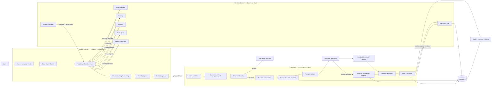

### One-line authority model

```text
AI decides WHAT is useful
        ↓
Merchant decides WHAT is true
        ↓
User decides the hard spending boundary
        ↓
MANDATE decides WHETHER money may move
        ↓
Razorpay executes the authorized payment
        ↓
PostgreSQL + verification prove WHAT happened
```

---

## 2. Agent orchestration architecture

The buyer is not a single prompt followed by checkout. It is a bounded observe → reason → tool → validate loop.

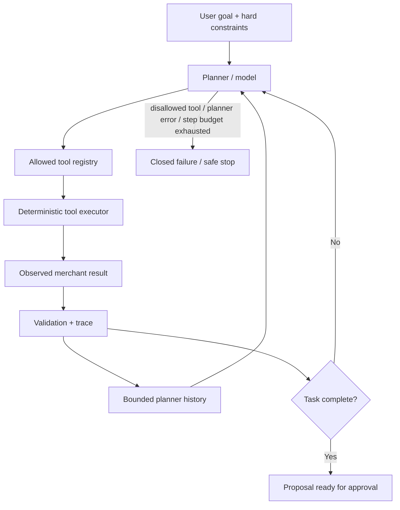

### Buyer tool boundary

The buyer agent operates on commerce intent and merchant facts. Payment execution is not part of its tool registry.

Typical model-directed actions include:

```text
discover_merchant
read_catalog / search_products
inspect_product
compare_products
select_product
check_inventory
get_merchant_recommendations
optimize_basket
build_basket
prepare_approval
```

The exact order is model-directed. A tool failure becomes an observation that can cause the planner to choose a different bounded action rather than silently inventing a result.

### Growth agent orchestration

The merchant growth agent uses the same pattern with a payment-blind tool set:

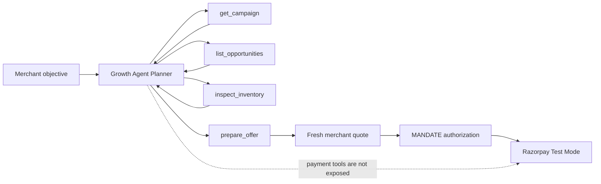

The Growth Agent can decide which commercial observation/action to take, but the payment authority remains outside the agent.

---

## 3. Trust boundaries

### Zone A — probabilistic / untrusted

**AI buyer + browser**

These components can:

- interpret natural-language requests;
- rank and explain products;
- suggest complementary products;
- collect user approval;
- display checkout state;
- execute bounded agent planning loops.

They cannot:

- change the hard spending limit;
- provide the trusted payment amount;
- call Razorpay using the server secret;
- declare a payment successful;
- confirm a merchant order;
- bypass gateway policy.

### Zone B — commerce truth

**Merchant APIs** own:

- products;
- prices;
- inventory;
- merchant identity;
- checkout quotes;
- merchant-defined recommendation opportunities;
- growth campaign configuration.

The merchant quote is the source of truth for the final basket amount.

### Zone C — trusted control plane

**MANDATE gateway** owns:

- intent validation;
- quote/inventory revalidation;
- financial policy;
- mandate authorization;
- transaction state;
- payment verification;
- webhook verification and dedupe;
- merchant-order confirmation;
- durable audit;
- realized revenue attribution.

### Zone D — payment execution

**Razorpay Test Mode** owns payment execution and payment events. It does not decide whether the user's basket is within the MANDATE policy boundary.

---

## 4. Buyer + merchant growth interaction

The Track 01 value loop is two-sided: the buyer provides autonomous demand, while the merchant provides machine-readable truth and revenue opportunities.

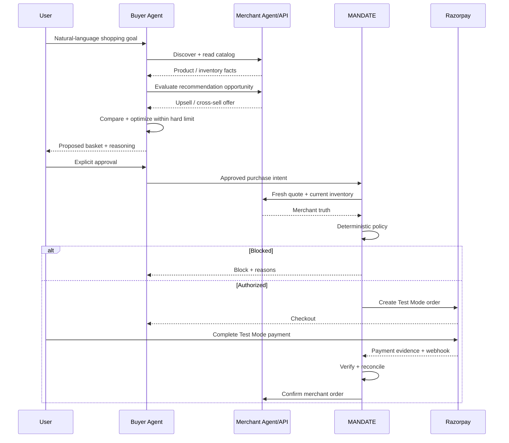

This separates **merchant opportunity generation** from **payment authority**. An upsell/cross-sell can increase basket value, but it must still pass explicit buyer approval and the same gateway policy.

---

## 5. Financial authorization boundary

The gateway never treats a model-produced amount as authoritative.

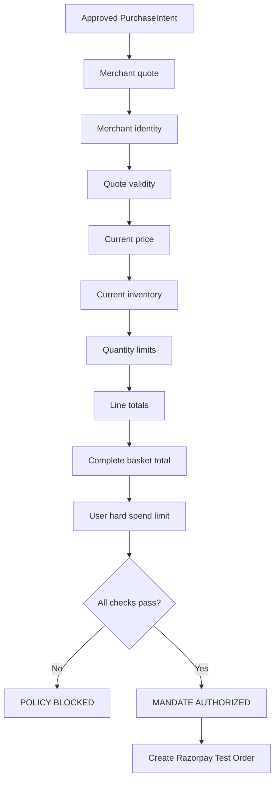

### Authorization algorithm

```text
1. Parse and validate PurchaseIntent.
2. Fetch the referenced merchant quote.
3. Verify merchant identity.
4. Verify quote has not expired.
5. Re-read current product prices.
6. Re-read current inventory.
7. Validate line quantities.
8. Validate line totals.
9. Recompute/validate complete basket total.
10. Compare complete total with user's hard spending limit.
11. Validate transaction state / mandate binding.
12. Allow only if every rule passes.
13. Only then create a Razorpay order.
```

This gives the project its central invariant:

> **No policy authorization → no Razorpay order.**

---

## 6. Transaction state machine

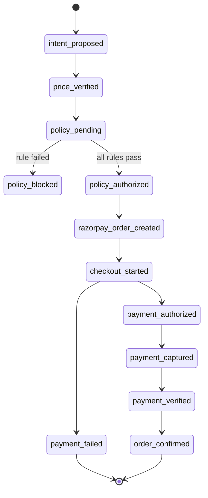

### State-machine invariants

```text
Invalid transition                    → reject
Policy blocked                        → never create Razorpay order
Payment failed                        → terminal attempt
Retry after failure                   → create new transaction
Captured / verified / confirmed       → late failure cannot regress state
Confirmed order                       → idempotent reprocessing only
```

---

## 7. Growth experiment architecture

The growth side is intentionally separated into **potential opportunity**, **approved treatment**, **real payment evidence**, and **realized uplift**.

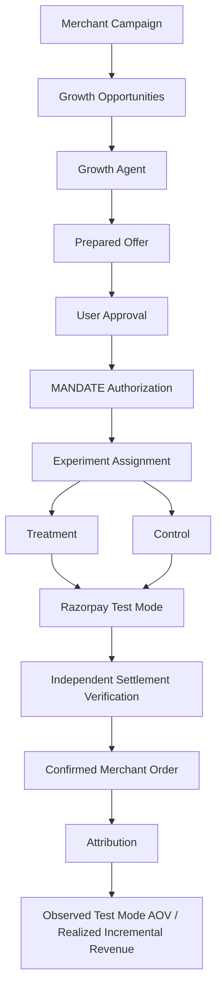

### What is measured

```text
Potential lift      = catalog / recommendation opportunity
Approved basket     = user-approved commercial intent
Verified payment    = independently checked Razorpay evidence
Realized uplift     = confirmed merchant-order attribution
Observed AOV uplift = treatment/control Test Mode comparison
```

The system deliberately avoids calling a recommendation or unverified browser callback revenue.

---

## 8. Payment lifecycle

The payment lifecycle is deliberately longer than “checkout returned success”.

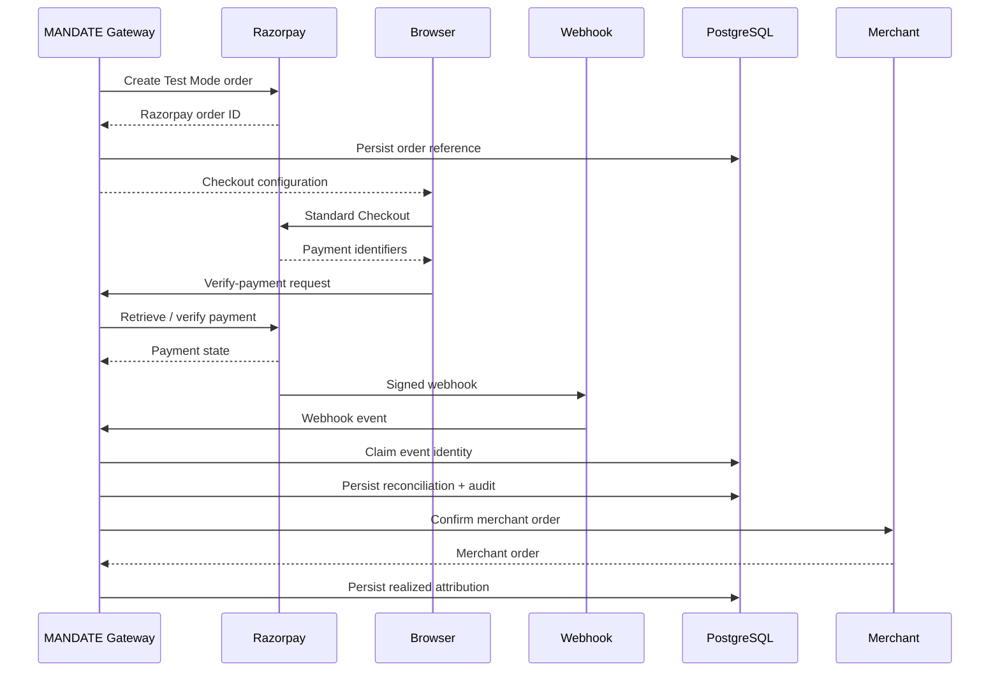

A browser callback may trigger reconciliation work, but it cannot directly mark the transaction paid or confirmed.

---

## 9. Webhook architecture

The webhook handler applies defense in depth:

```text
Raw request body
      ↓
Signature verification
      ↓
Dedupe identity
      ↓
In-flight duplicate guard
      ↓
Persistent PostgreSQL claim
      ↓
Transaction lookup
      ↓
Payment-state reconciliation
      ↓
Audit event
      ↓
Claim completion
```

If processing fails after a persistent claim, the claim is released so a later legitimate retry can be processed.

---

## 10. Persistence architecture

PostgreSQL is used for durable control-plane evidence:

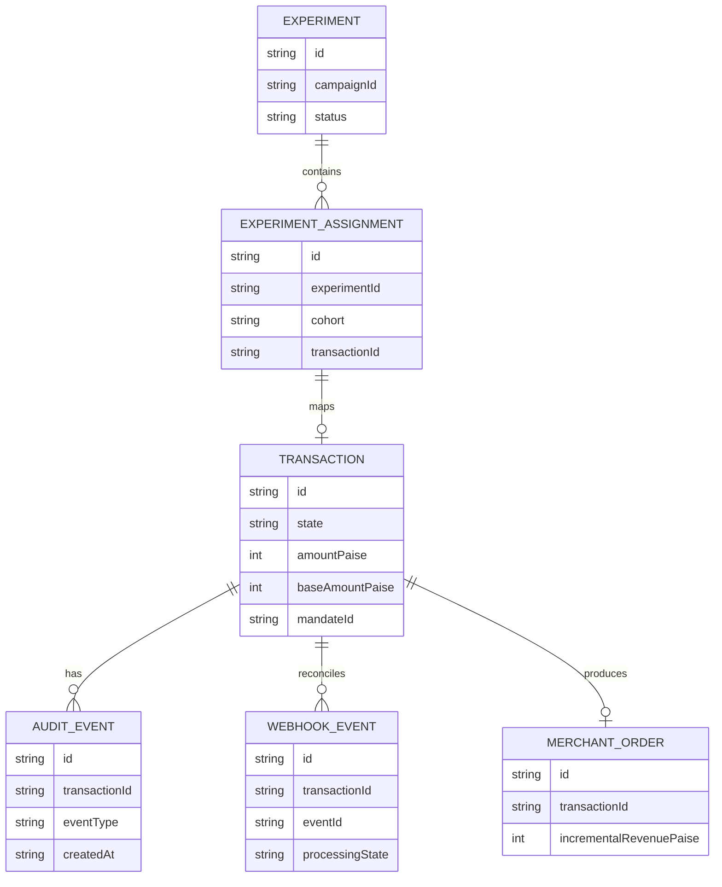

Runtime state can be hydrated from PostgreSQL on startup. Merchant-order attribution is persisted so revenue reporting does not depend on an in-memory process surviving.

The current reference implementation intentionally leaves some merchant catalog/quote storage lightweight; this is documented as a boundary rather than implying a distributed production catalog.

---

## 11. Multi-protocol control plane

MANDATE is designed so protocol-specific wire details terminate at adapters while the financial authority remains centralized.

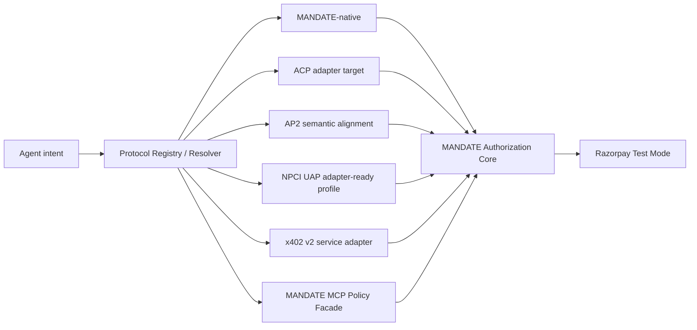

Protocol status is intentionally explicit in the repository. Native MANDATE and the x402 experiment are implemented; ACP/AP2/UAP are represented as adapter-target, semantic-alignment or research/adapter-ready surfaces rather than being presented as wire-level integrations that the repository does not actually claim. The unified control plane keeps these protocol concerns from creating separate payment-authority logic.

---

## 12. Judge / evidence architecture

The judge-facing UI is not part of the financial authority. It exposes evidence produced by the trusted backend.

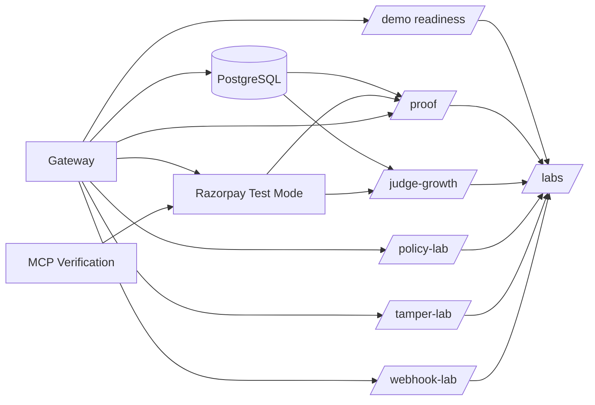

### Evidence principle

```text
Browser state                         = presentation only
AI recommendation                     = proposal only
Local synthetic lab event             = security simulation only
Persisted transaction + policy trail  = control-plane evidence
Razorpay Test Mode re-read            = payment evidence
Confirmed merchant order              = revenue evidence
```

---

## 13. Data ownership

| Data | Owner | Durable? | Why |
|---|---|---:|---|
| User request | Buyer | Runtime | Input to model reasoning |
| Model plan | Buyer | Runtime / trace | Planning output, not authority |
| Product / price | Merchant | Merchant service | Commerce truth |
| Inventory | Merchant | Merchant service | Availability truth |
| Checkout quote | Merchant | Current reference implementation is lightweight | Trusted monetary quote source |
| PurchaseIntent | Gateway | PostgreSQL-backed transaction record | Authorization evidence |
| Policy result | Gateway | Audit-backed | Why money was/was not allowed |
| Mandate artifact | Gateway | Transaction/audit-backed | Financial authorization evidence |
| Razorpay order ID | Gateway | Transaction persistence | Link to payment rail |
| Payment state | Gateway + Razorpay | Transaction/audit persistence | Reconciliation evidence |
| Webhook identity | Gateway | PostgreSQL-backed | Replay protection |
| Merchant order | Merchant + gateway | PostgreSQL attribution | Durable outcome |
| Experiment assignment | Merchant/growth flow | PostgreSQL-backed | Treatment/control evidence |
| Revenue attribution | Gateway/merchant operations | PostgreSQL-backed | Potential vs realized revenue |

This ownership model prevents a frontend variable or model response from silently becoming a source of financial truth.

---

## 14. Interfaces

### Merchant

```text
GET  /.well-known/agent-commerce
GET  /api/agent/catalog
GET  /api/agent/products/:id
GET  /api/agent/inventory/:id
POST /api/agent/checkout/preview
GET  /api/agent/checkout/quotes/:id
GET  /api/agent/recommendations?productId=:id&maxSpendPaise=:limit
POST /api/agent/orders/confirm
```

### Buyer agent / growth agent

```text
POST /api/agent/buyer
GET  /api/agent/buyer?runId=<id>
POST /api/agent/growth-agent
GET  /api/agent/growth-agent?runId=<id>
```

### Gateway

```text
GET  /health
POST /v1/purchase-intents
POST /v1/mandates/authorize
POST /v1/transactions/:id/razorpay-order
POST /v1/transactions/:id/checkout-started
POST /v1/transactions/:id/verify-payment
POST /v1/transactions/:id/capture
POST /v1/transactions/:id/retry-payment
GET  /v1/transactions/:id/timeline
GET  /v1/merchant/orders
POST /v1/webhooks/razorpay
```

### Judge surfaces

```text
/golden-path
/live-proof
/proof
/labs
/policy-lab
/tamper-lab
/webhook-lab
/demo
/judge-growth
/growth
/growth-experiment
/growth-attribution
```

---

## 15. Security invariants

```text
LLM → Razorpay API                         forbidden
Browser → payment success state            forbidden
AI → spending-limit modification           forbidden
Client amount → trusted order amount       forbidden
Policy BLOCK → Razorpay order              forbidden
Unverified payment → merchant order        forbidden
Duplicate webhook → duplicate effect       forbidden
Late failure → successful-state regression forbidden
Retry → mutation of the old failed attempt forbidden
Growth Agent → payment authority           forbidden
Synthetic lab event → live payment claim   forbidden
Potential lift → realized revenue claim    forbidden
```

These invariants are reinforced in source, tests and the judge-facing labs.

---

## 16. Why this architecture is suitable for agentic commerce

A human-driven storefront can often rely on the person behind the browser to notice price, identity, inventory and payment mistakes. An autonomous buyer changes the threat model: the software can make decisions at machine speed and the user may not inspect every intermediate action.

MANDATE therefore separates:

```text
Decision quality
      ≠
Financial authority
```

AI gets the flexibility that makes agentic commerce useful. Deterministic systems get the authority that makes monetary actions bounded and auditable.

The merchant-growth layer adds a second separation:

```text
Revenue opportunity
      ≠
Realized revenue
```

A recommendation can be agentically generated, a basket can be approved, and a payment can be executed, but only a verified confirmed merchant order can contribute to realized uplift.

That separation is the core architectural idea of the submission.
