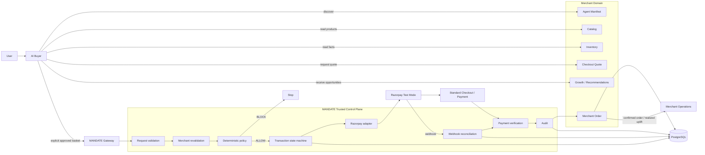
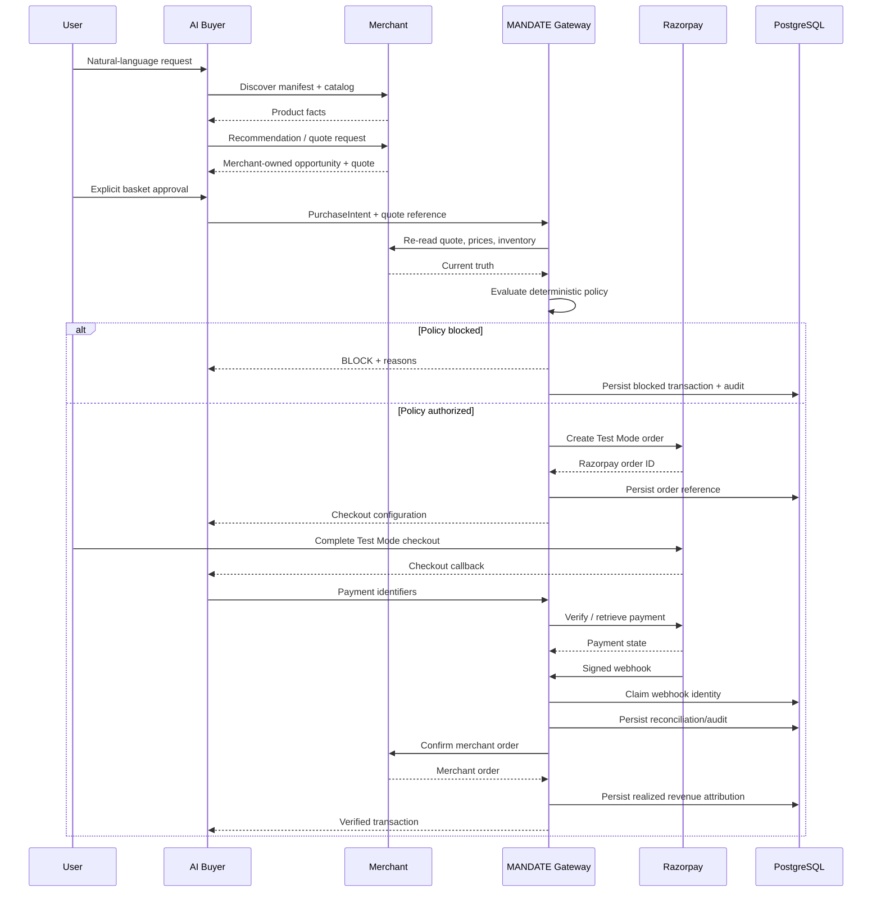

# MANDATE Architecture

## Executive view

**MANDATE is an agentic-commerce control plane, not an LLM checkout script.**

Its architecture deliberately separates four responsibilities:

```text
AI reasoning      → decides what is relevant
Merchant systems  → define what is true
Gateway policy    → decides whether money may move
Razorpay          → executes the payment
```

The resulting system is easier to reason about because the probabilistic layer and the financial authorization layer are separate.

---

## 1. System architecture



---

## 2. Trust boundaries

### Zone A — probabilistic / untrusted

**AI buyer + browser**

These components can:

- interpret natural-language requests;
- rank and explain products;
- suggest complementary products;
- collect user approval;
- display checkout state.

They cannot:

- change the hard spending limit;
- provide the trusted payment amount;
- call Razorpay using the server secret;
- declare a payment successful;
- confirm a merchant order.

### Zone B — commerce truth

**Merchant APIs** own:

- products;
- prices;
- inventory;
- merchant identity;
- checkout quotes;
- merchant-defined recommendation opportunities.

The merchant quote is the source of truth for the final basket amount.

### Zone C — trusted control plane

**MANDATE gateway** owns:

- intent validation;
- quote/inventory revalidation;
- financial policy;
- transaction state;
- payment verification;
- webhook verification and dedupe;
- merchant-order confirmation;
- durable audit.

### Zone D — payment execution

**Razorpay Test Mode** owns payment execution and payment events. It does not decide whether the user's basket is within the MANDATE policy boundary.

---

## 3. Golden transaction sequence



---

## 4. Financial authorization boundary

The gateway never treats a model-produced amount as authoritative.

The authorization algorithm is conceptually:

```text
1. Parse and validate PurchaseIntent.
2. Fetch the referenced merchant quote.
3. Verify merchant identity.
4. Verify quote has not expired.
5. Re-read current product prices.
6. Re-read current inventory.
7. Validate line quantities.
8. Validate line totals.
9. Recompute/validate complete basket total.
10. Compare complete total with user's hard spending limit.
11. Allow only if every rule passes.
12. Only then create a Razorpay order.
```

This gives the project a crisp invariant:

> **No policy authorization → no Razorpay order.**

---

## 5. Transaction state machine

```text
intent_proposed
      │
      ▼
price_verified
      │
      ▼
policy_pending
      │
      ├───────────────► policy_blocked
      │
      ▼
policy_authorized
      │
      ▼
razorpay_order_created
      │
      ▼
checkout_started
      │
      ├───────────────► payment_failed
      │
      ▼
payment_authorized
      │
      ▼
payment_captured
      │
      ▼
payment_verified
      │
      ▼
order_confirmed
```

### State-machine invariants

```text
Invalid transition                    → reject
Policy blocked                        → never create Razorpay order
Payment failed                        → terminal attempt
Retry after failure                   → create new transaction
Captured / verified / confirmed       → late failure cannot regress state
Confirmed order                       → idempotent reprocessing only
```

---

## 6. Data ownership

| Data | Owner | Durable? | Why |
|---|---|---:|---|
| User request | Buyer | Runtime | Input to model reasoning |
| Model plan | Buyer | Runtime | Planning output, not authority |
| Product / price | Merchant | Merchant service | Commerce truth |
| Inventory | Merchant | Merchant service | Availability truth |
| Checkout quote | Merchant | Current reference implementation is lightweight/in-memory | Trusted monetary quote source |
| PurchaseIntent | Gateway | PostgreSQL-backed transaction record | Authorization evidence |
| Policy result | Gateway | Audit-backed | Why money was/was not allowed |
| Razorpay order ID | Gateway | Transaction persistence | Link to payment rail |
| Payment state | Gateway + Razorpay | Transaction/audit persistence | Reconciliation evidence |
| Webhook identity | Gateway | PostgreSQL-backed | Replay protection |
| Merchant order | Merchant + gateway | PostgreSQL attribution | Durable outcome |
| Revenue attribution | Gateway/merchant operations | PostgreSQL-backed | Potential vs realized revenue |

This ownership model prevents a frontend variable or model response from silently becoming a source of financial truth.

---

## 7. Revenue / growth flow

```text
Source product
      ↓
Merchant-owned campaign / recommendation logic
      ↓
Eligible opportunity
      ↓
AI presents opportunity
      ↓
User approval
      ↓
Combined basket
      ↓
Fresh merchant quote
      ↓
Gateway policy
      ↓
Payment
      ↓
Confirmed order
      ↓
Realized incremental revenue
```

The system distinguishes:

```text
Potential lift   = recommendation opportunity
Approved basket  = user-approved intent
Realized uplift  = confirmed order attribution
```

This is important because recommendation impressions are not revenue.

---

## 8. Payment lifecycle

The payment lifecycle is deliberately longer than "checkout returned success":

```text
Razorpay order created
        ↓
Checkout started
        ↓
Payment identifiers returned
        ↓
Server-side signature verification
        ↓
Payment retrieved / captured as required
        ↓
Signed webhook received
        ↓
Webhook dedupe claim
        ↓
Payment reconciled
        ↓
Merchant order confirmed
        ↓
Revenue attribution persisted
```

A browser callback can trigger reconciliation work, but it cannot directly mark the transaction paid.

---

## 9. Webhook architecture

The webhook handler applies defense in depth:

```text
Raw request body
      ↓
Signature verification
      ↓
Dedupe identity
      ↓
In-flight duplicate guard
      ↓
Persistent PostgreSQL claim
      ↓
Transaction lookup
      ↓
Payment-state reconciliation
      ↓
Audit event
      ↓
Claim completion
```

If processing fails after a persistent claim, the claim is released so a later legitimate retry can be processed.

---

## 10. Persistence architecture

PostgreSQL is used for durable control-plane evidence:

```text
┌───────────────────────────────┐
│          PostgreSQL           │
├───────────────────────────────┤
│ transactions                  │
│ audit_events                  │
│ webhook_events                │
│ merchant_orders               │
└───────────────────────────────┘
              ▲
              │ startup hydration
              │
       MANDATE gateway
```

The gateway initializes persistence and hydrates runtime transaction/audit state on startup. Merchant-order attribution is also loaded for revenue reporting.

The current reference implementation intentionally leaves the merchant quote store lightweight; this is documented as a boundary rather than implying a distributed production catalog.

---

## 11. Interfaces

### Merchant

```text
GET  /.well-known/agent-commerce
GET  /api/agent/catalog
GET  /api/agent/products/:id
GET  /api/agent/inventory/:id
POST /api/agent/checkout/preview
GET  /api/agent/checkout/quotes/:id
GET  /api/agent/recommendations?productId=:id&maxSpendPaise=:limit
POST /api/agent/orders/confirm
```

### Gateway

```text
GET  /health
POST /v1/purchase-intents
POST /v1/transactions/:id/razorpay-order
POST /v1/transactions/:id/checkout-started
POST /v1/transactions/:id/verify-payment
POST /v1/transactions/:id/capture
POST /v1/transactions/:id/retry-payment
GET  /v1/transactions/:id/timeline
GET  /v1/merchant/orders
POST /v1/webhooks/razorpay
```

### Judge surfaces

```text
/golden-path
/live-proof
/proof
/labs
/policy-lab
/tamper-lab
/webhook-lab
/demo
```

---

## 12. Security invariants

```text
LLM → Razorpay API                         forbidden
Browser → payment success state            forbidden
AI → spending-limit modification           forbidden
Client amount → trusted order amount       forbidden
Policy BLOCK → Razorpay order              forbidden
Unverified payment → merchant order        forbidden
Duplicate webhook → duplicate effect       forbidden
Late failure → successful-state regression forbidden
Retry → mutation of the old failed attempt forbidden
```

These invariants are reinforced in source, tests and the judge-facing labs.

---

## 13. Why this architecture is suitable for agentic commerce

A human-driven storefront can often rely on the person behind the browser to notice price, identity, inventory and payment mistakes. An autonomous buyer changes the threat model: the software can make decisions at machine speed and the user may not inspect every intermediate action.

MANDATE therefore separates:

```text
Decision quality
      ≠
Financial authority
```

AI gets the flexibility that makes agentic commerce useful. Deterministic systems get the authority that makes monetary actions bounded and auditable.

That separation is the core architectural idea of the submission.
