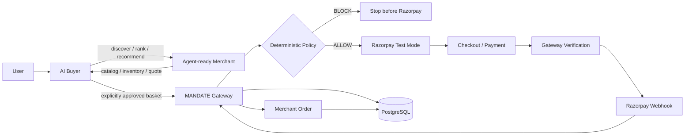

# MANDATE

### Agentic commerce where the AI can decide **what** to buy, but never **whether money is allowed to move**.

[](https://github.com/akashrajeev/AgenticCommerce/actions/workflows/ci.yml)

**Track:** Razorpay AI Buildathon — Track 01: **AI Growth & Agentic Commerce**

> **AI recommends. The user owns the limit. The merchant owns price and inventory. The gateway authorizes. Razorpay executes. PostgreSQL proves what happened.**

MANDATE is an end-to-end agentic commerce control plane built around a simple trust boundary: an AI buyer can interpret intent, discover a merchant, rank products and surface revenue opportunities, but it cannot independently authorize a monetary action.

---

## Why this project is different

A normal AI shopping demo ends with an LLM saying **"buy this"**.

MANDATE keeps going:

```text
Natural-language intent
        ↓
AI buyer reasoning
        ↓
Agent-readable merchant
        ↓
Product / upsell recommendation
        ↓
Explicit user approval
        ↓
Fresh merchant quote
        ↓
Deterministic gateway policy
        ↓
Razorpay Test Mode
        ↓
Payment verification
        ↓
Webhook reconciliation
        ↓
Merchant order
        ↓
Realized revenue + audit evidence
```

The important architectural rule is:

```text
LLM / browser
     │
     │ may propose
     ▼
MANDATE GATEWAY
     │
     │ must authorize
     ▼
RAZORPAY
     │
     │ executes
     ▼
POSTGRESQL + AUDIT
     │
     │ proves
     ▼
Merchant order / revenue
```

**The model is a decision-maker for commerce intent, not a financial authority.**

---

# Judge-first reading order

A reviewer does not need to run the repository to understand the design.

| Start here | What it proves |
|---|---|
| [`TRACK-01-COVERAGE.md`](./TRACK-01-COVERAGE.md) | Track 01 capability → implementation → evidence |
| [`docs/FEATURE-INVENTORY.md`](./docs/FEATURE-INVENTORY.md) | Complete feature-by-feature implementation and verification inventory |
| [`ARCHITECTURE.md`](./ARCHITECTURE.md) | Trust boundaries, state machine, data flow and invariants |
| [`SECURITY-MODEL.md`](./SECURITY-MODEL.md) | Threat model, protected invariants and adversarial cases |
| [`docs/GOLDEN-PATH.md`](./docs/GOLDEN-PATH.md) | Canonical end-to-end scenario |
| [`docs/FINAL-DEMO.md`](./docs/FINAL-DEMO.md) | 90-second judge script and proof sequence |
| [`docs/VERIFICATION.md`](./docs/VERIFICATION.md) | What has been exercised, what CI validates, and known limits |
| `apps/gateway/src/transaction-core.ts` | Deterministic financial policy boundary |
| `apps/gateway/src/app.ts` | Razorpay, payment and webhook lifecycle |
| `apps/merchant/src/lib/revenue.ts` | Merchant upsell / cross-sell engine |
| `apps/buyer/src/app/BuyerWorkspace.tsx` | AI buyer + explicit approval + checkout |

### Judge surfaces in the running app

```text
Buyer:       http://localhost:3001
Merchant:    http://localhost:3000
Gateway:     http://localhost:4000
Judge Labs:  http://localhost:3001/labs
Proof:       http://localhost:3001/proof
Demo check:  http://localhost:3001/demo
```

The `/labs` area is the control room: policy boundary, amount-integrity tamper test, webhook replay test, persistence proof, unified proof and the canonical golden path are all surfaced from one place.

---

# Track 01 coverage at a glance

| Capability | MANDATE |
|---|---|
| AI buyer | Natural-language request → structured purchase plan |
| Conversational commerce | Buyer interprets intent and prepares a transaction |
| Agent-readable merchant | Machine-readable manifest, catalog, inventory and checkout APIs |
| Merchant discovery | Buyer reads the merchant contract instead of scraping UI |
| Product ranking | Model-backed ranking over live merchant facts |
| Upsell / cross-sell | Merchant-owned recommendation engine |
| Revenue growth | Basket uplift attributed to confirmed merchant orders |
| Campaign loop | Merchant-controlled growth campaign model and opportunities |
| User approval | Recommendations remain proposals until explicitly approved |
| Bounded spending | Gateway-enforced hard max-spend policy |
| Inventory safety | Fresh inventory validation before authorization |
| Price / amount integrity | Gateway trusts merchant quote, not client amount |
| Quote validity | Expired quote is blocked |
| Merchant integrity | Quote merchant must match purchase intent |
| Quantity safety | Gateway enforces per-line and total basket limits |
| Razorpay integration | Real Razorpay Test Mode Orders / Checkout / Payments flow |
| Payment verification | Server-side checkout signature + payment reconciliation |
| Webhooks | Signature verification + persistent idempotency |
| Failure recovery | Failed attempt preserved; retry creates a new transaction |
| Auditability | Transaction and webhook lifecycle are recorded |
| Persistence | PostgreSQL-backed transaction, audit, webhook and order attribution data |
| Restart resilience | Gateway hydrates runtime state from PostgreSQL |
| Judge proof | Dedicated policy, tamper, replay, persistence and unified-proof surfaces |
| Reproducibility | Docker Compose + CI typecheck/tests/build |

The full capability-to-code map is in [`TRACK-01-COVERAGE.md`](./TRACK-01-COVERAGE.md), and the complete feature inventory is in [`docs/FEATURE-INVENTORY.md`](./docs/FEATURE-INVENTORY.md).

---

# Architecture



### Trust model

| Component | Trust | Authority |
|---|---|---|
| AI buyer | Untrusted / probabilistic | Intent interpretation, ranking, explanations, recommendations |
| Browser | Untrusted | Presentation and user interaction |
| Merchant | Commerce truth | Product, price, inventory, quote, recommendation opportunities |
| MANDATE gateway | Trusted control plane | Financial authorization, state transitions, verification |
| Razorpay Test Mode | Payment rail | Payment execution and payment events |
| PostgreSQL | Durable evidence | Transactions, audit, webhook dedupe, merchant order attribution |

### The gateway owns the money boundary

Before a Razorpay order can be created, the gateway independently checks:

```text
✓ merchant identity
✓ product existence
✓ current product price
✓ inventory
✓ quote validity
✓ quote line totals
✓ quantity limits
✓ complete basket total
✓ user's hard spending limit
✓ transaction state
```

A policy **BLOCK** ends the flow before Razorpay order creation.

---

# The golden path

The canonical demonstration is deliberately simple:

```text
User:
"Find me the best ANC headphones under ₹5,000."

AI buyer
  → discovers Mandate Market
  → ranks eligible products
  → selects SoundMax Pro

Merchant growth engine
  → surfaces a complementary recommendation

User
  → explicitly approves the basket expansion

Merchant
  → creates a fresh combined quote

Gateway
  → revalidates every line
  → evaluates deterministic policy

Razorpay Test Mode
  → creates order
  → runs Standard Checkout
  → returns payment evidence

Gateway
  → verifies payment
  → reconciles webhook
  → confirms merchant order

Merchant
  → records realized incremental revenue
```

The same basket is then demonstrated against a lower user hard limit:

```text
₹5,000 limit
    ↓
combined basket exceeds limit
    ↓
MAX_SPEND = FAIL
    ↓
POLICY = BLOCK
    ↓
NO RAZORPAY ORDER
```

Raise the user-controlled limit and rerun:

```text
₹8,000 limit
    ↓
all checks pass
    ↓
POLICY = AUTHORIZED
    ↓
RAZORPAY ORDER CREATED
```

This makes the central security property visible rather than theoretical.

See [`docs/GOLDEN-PATH.md`](./docs/GOLDEN-PATH.md) for the complete script.

---

# Merchant revenue engine

MANDATE is not only a payment gate. It also addresses the **merchant-growth** side of agentic commerce.

The merchant publishes machine-readable recommendation opportunities and a deterministic engine scores candidates using signals such as:

- category compatibility;
- shared product attributes;
- rating / review proof;
- relative price;
- inventory availability;
- optional spending ceiling.

The resulting opportunity is still only a recommendation:

```text
Merchant opportunity
        ↓
AI presents it
        ↓
User approves it
        ↓
Fresh quote
        ↓
Gateway policy
        ↓
Confirmed order
        ↓
Realized incremental revenue
```

The merchant growth console explicitly separates:

```text
Potential lift   = catalog opportunity
Realized uplift  = confirmed order attribution
```

That prevents recommendation volume from being misrepresented as revenue.

---

# Security and failure engineering

MANDATE treats agentic commerce as a **trust-boundary problem**, not merely an LLM problem.

### Protected invariants

```text
LLM → Razorpay API                         forbidden
AI → spending-limit modification           forbidden
Browser amount → trusted payment amount    forbidden
Policy BLOCK → Razorpay order              forbidden
Unverified payment → merchant order        forbidden
Duplicate webhook → duplicate effect       forbidden
Failed attempt → silent mutation to success forbidden
Late failure → successful-state regression forbidden
```

### Adversarial scenarios implemented

| Scenario | Expected result |
|---|---|
| Spend above hard limit | Block before Razorpay |
| False client-side amount | Merchant quote remains authoritative |
| Expired quote | Block |
| Insufficient inventory | Block |
| Wrong merchant | Block |
| Tampered line price | `AMOUNT_INTEGRITY` fails |
| Invalid state transition | Rejected |
| Duplicate payment callback | No duplicate state transition |
| Duplicate webhook identity | Persistent dedupe → duplicate |
| Late failure after success | No regression; event remains auditable |
| Payment retry | New transaction, fresh policy evaluation |
| Unauthorized merchant confirmation | Rejected by internal gateway secret |

More detail: [`SECURITY-MODEL.md`](./SECURITY-MODEL.md).

---

# Razorpay Test Mode integration

MANDATE uses the real Razorpay Test Mode payment rail rather than a fake payment screen.

```text
Gateway
  → Razorpay Orders API
  → Standard Checkout
  → Test Mode payment
  → server-side signature verification
  → payment retrieval / capture
  → webhook verification + reconciliation
  → merchant order
```

The Razorpay API secret and webhook secret stay server-side. The browser only receives the public key information needed for Standard Checkout.

The project has also been exercised against Razorpay Test Mode during development; the resulting test payment activity is visible in the Razorpay Dashboard, providing an independent payment-rail artifact alongside the MANDATE transaction/audit record.

**Important:** Test Mode is not production money movement. A real end-to-end webhook demonstration still requires configured Test credentials and a publicly reachable webhook target or supported tunnel.

See [`docs/razorpay/`](./docs/razorpay/) for implementation notes and researched references.

---

# Quick start

## Prerequisites

- Node.js `>= 22`
- npm `>= 10`
- Docker + Docker Compose
- Razorpay Test Mode credentials for the live checkout path
- An OpenAI-compatible model endpoint for model-backed planning

## One-command local stack

```bash
docker compose up --build
```

Then open:

```text
Buyer       http://localhost:3001
Merchant    http://localhost:3000
Gateway     http://localhost:4000
Judge Labs  http://localhost:3001/labs
```

PostgreSQL is included as the `postgres` Compose service and persists through a named Docker volume.

## Development commands

```bash
npm ci
npm run typecheck
npm test
npm run build
```

The same typecheck, unit-test and build stages run in GitHub Actions.

---

# Environment and secrets

The exact environment files are intentionally kept out of version control.

### Gateway secrets

```text
RAZORPAY_KEY_ID
RAZORPAY_KEY_SECRET
RAZORPAY_WEBHOOK_SECRET
INTERNAL_GATEWAY_SECRET
```

### Model configuration

```text
OPENAI_BASE_URL
OPENAI_API_KEY
OPENAI_MODEL
```

### Rules

```text
Never commit API secrets.
Never expose RAZORPAY_KEY_SECRET to the browser.
Never expose RAZORPAY_WEBHOOK_SECRET to the browser.
Never let the client declare a payment successful.
```

---

# Repository map

```text
AgenticCommerce/
├── apps/
│   ├── buyer/
│   │   └── src/app/
│   │       ├── api/agent/purchase-plan/   # model-backed buyer planning
│   │       ├── BuyerWorkspace.tsx         # buyer + explicit approval + checkout
│   │       ├── golden-path/               # canonical Track 01 flow
│   │       ├── labs/                      # judge control room
│   │       ├── policy-lab/                # spend-boundary demonstration
│   │       ├── tamper-lab/                # amount-integrity demonstration
│   │       ├── webhook-lab/               # replay/idempotency demonstration
│   │       ├── proof/                     # unified transaction proof
│   │       └── demo/                      # demo readiness
│   │
│   ├── merchant/
│   │   └── src/
│   │       ├── app/api/agent/             # agent commerce contract
│   │       ├── app/growth/                # merchant growth command center
│   │       ├── app/operations/            # transaction/revenue operations
│   │       └── lib/revenue.ts             # recommendation engine
│   │
│   └── gateway/
│       └── src/
│           ├── app.ts                     # HTTP / Razorpay / webhook boundary
│           ├── transaction-core.ts         # deterministic policy/state machine
│           ├── persistence.ts              # PostgreSQL durability
│           └── razorpay.ts                 # payment adapter
│
├── packages/
│   ├── types/                             # shared contracts
│   ├── schemas/                            # validation schemas
│   └── shared/                             # common runtime helpers
│
├── database/
│   └── init.sql                           # PostgreSQL schema/bootstrap
│
├── docs/
│   ├── CONTEXT.md
│   ├── FEATURE-INVENTORY.md
│   ├── GOLDEN-PATH.md
│   ├── FINAL-DEMO.md
│   ├── VERIFICATION.md
│   └── razorpay/                          # integration research/notes
│
├── TRACK-01-COVERAGE.md
├── ARCHITECTURE.md
├── SECURITY-MODEL.md
├── docker-compose.yml
└── .github/workflows/ci.yml
```

---

# Machine-readable merchant contract

The buyer does not scrape the storefront. It consumes the merchant's agent commerce contract:

```text
GET  /.well-known/agent-commerce
GET  /api/agent/catalog
GET  /api/agent/products/:id
GET  /api/agent/inventory/:id
POST /api/agent/checkout/preview
GET  /api/agent/checkout/quotes/:id
GET  /api/agent/recommendations?productId=:id&maxSpendPaise=:limit
POST /api/agent/orders/confirm
```

This contract is what makes the merchant accessible to software buyers rather than only human browsers.

---

# Gateway API surface

```text
GET  /health
POST /v1/purchase-intents
POST /v1/transactions/:id/razorpay-order
POST /v1/transactions/:id/checkout-started
POST /v1/transactions/:id/verify-payment
POST /v1/transactions/:id/capture
POST /v1/transactions/:id/retry-payment
GET  /v1/transactions/:id/timeline
GET  /v1/merchant/orders
POST /v1/webhooks/razorpay
```

The gateway is intentionally the only component that can progress a transaction into payment execution.

---

# What is actually validated

MANDATE uses CI as a hard quality gate for the repository:

```text
Install dependencies
      ↓
Typecheck
      ↓
Gateway / merchant / buyer validation
      ↓
Unit tests
      ↓
Build
```

The development workflow has also exercised the real Docker Compose stack, the AI buyer / merchant contract path, deterministic policy blocking, Razorpay Test Mode checkout/payment behavior, webhook handling, persistence/restart behavior and the judge-facing safety labs.

For the exact verification matrix and known boundaries, see [`docs/VERIFICATION.md`](./docs/VERIFICATION.md).

---

# Known boundaries — stated explicitly

This repository deliberately distinguishes **implemented proof** from **production claims**.

### Current boundaries

- Razorpay is configured for Test Mode; production funds are not part of the demo.
- A real webhook demonstration needs a publicly reachable webhook endpoint or supported tunnel.
- The merchant quote store is intentionally lightweight/in-memory in the current reference implementation.
- The AI planner requires an OpenAI-compatible model endpoint for live model-backed reasoning.
- The synthetic replay and tamper labs validate deterministic mechanisms in isolation; they are not disguised as real Razorpay events.

These boundaries are documented rather than hidden.

---

# The one-sentence pitch

> **MANDATE is the control plane for agentic commerce: AI discovers and recommends, the user defines the spending boundary, the merchant provides commerce truth, a deterministic gateway authorizes money, Razorpay executes it, and the audit trail proves the result.**

---

## Documentation

- [`TRACK-01-COVERAGE.md`](./TRACK-01-COVERAGE.md) — Track 01 requirement map
- [`docs/FEATURE-INVENTORY.md`](./docs/FEATURE-INVENTORY.md) — complete feature inventory
- [`ARCHITECTURE.md`](./ARCHITECTURE.md) — architecture and state machine
- [`SECURITY-MODEL.md`](./SECURITY-MODEL.md) — security model and adversarial cases
- [`docs/GOLDEN-PATH.md`](./docs/GOLDEN-PATH.md) — canonical scenario
- [`docs/FINAL-DEMO.md`](./docs/FINAL-DEMO.md) — final judge runbook
- [`docs/VERIFICATION.md`](./docs/VERIFICATION.md) — verification matrix and known limits
- [`docs/razorpay/`](./docs/razorpay/) — Razorpay integration research
