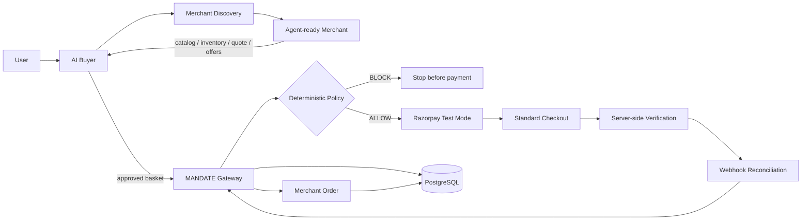

# MANDATE

## Agentic commerce where AI can decide **what to buy**, but never **whether money is allowed to move**.

[](https://github.com/akashrajeev/AgenticCommerce/actions/workflows/ci.yml)

**Razorpay AI Buildathon · Track 01 — AI Growth & Agentic Commerce**

> **AI interprets intent. The merchant supplies commerce truth. The user owns the spending boundary. MANDATE authorizes. Razorpay executes. PostgreSQL proves what happened.**

MANDATE is an end-to-end **agentic commerce control plane** built for a world where AI agents can discover merchants, compare products, negotiate offers, build baskets and pursue merchant growth objectives — without giving a probabilistic model direct control over money.

The core idea:

```text
AI decides what is commercially useful.
MANDATE decides whether money may move.
Razorpay executes the authorized payment.
```

---

# Why MANDATE?

A typical AI shopping demo ends with:

```text
User request → LLM recommendation → "Buy this"
```

MANDATE continues all the way to a **bounded, auditable transaction**:

```text
Natural-language intent
        ↓
AI buyer orchestration
        ↓
Agent-readable merchant discovery
        ↓
Live catalog + inventory
        ↓
Product comparison / ranking
        ↓
Merchant upsell / cross-sell opportunity
        ↓
Explicit user approval
        ↓
Fresh merchant quote
        ↓
Deterministic MANDATE policy
        ↓
Razorpay Test Mode
        ↓
Standard Checkout
        ↓
Server-side payment verification
        ↓
Webhook reconciliation
        ↓
Confirmed merchant order
        ↓
Realized revenue attribution
        ↓
Persistent audit evidence
```

The AI can be autonomous on the **commerce-decision side** while the financial boundary remains deterministic and server-controlled.

---

# What makes the project stand out

### 1. A real agent, not just an LLM response

The Buyer Agent is a bounded, tool-using loop. The model chooses the next allowed action, observes the result and can recover from tool failures instead of blindly following a fixed script.

Example:

```text
SEARCH_PRODUCTS
      ↓
CATALOG_NOT_LOADED
      ↓
READ_CATALOG
      ↓
continue planning
```

The Growth Agent uses the same pattern on the merchant side: it chooses among an allow-listed set of commercial tools and has no payment tool available.

### 2. AI and payment authority are deliberately separated

```text
AI Buyer / Growth Agent
        │
        │ propose / rank / explain
        ▼
MANDATE
        │
        │ authenticate / authorize / enforce policy
        ▼
Razorpay Test Mode
        │
        │ execute payment
        ▼
Merchant order + evidence
```

The model never receives a Razorpay secret, never controls the final trusted payment amount and never receives a direct payment-authorizing tool.

### 3. Merchant growth is measurable

MANDATE separates:

```text
Potential lift  = a recommendation opportunity
Realized uplift = incremental revenue on a confirmed merchant order
```

The growth experiment layer supports treatment/control assignment, bounded Test Mode cohorts and independent Razorpay evidence before payment contributes to the uplift evidence.

### 4. Proof is stronger than the UI

The system does not treat a browser callback or an LLM response as payment truth. The proof chain joins:

```text
AI intent
→ policy decision
→ Razorpay order
→ Razorpay payment
→ captured / verified settlement
→ webhook evidence
→ merchant order
→ revenue attribution
```

---

# Track 01 coverage at a glance

| Track 01 capability | MANDATE implementation |
|---|---|
| AI buyer | Model-backed natural-language planning and bounded tool orchestration |
| Conversational commerce | User intent → product plan → basket → approval |
| Agent-readable merchant | Versioned manifest, catalog, product, inventory and checkout APIs |
| Merchant discovery | Buyer reads the machine-readable commerce contract rather than scraping the storefront |
| Product ranking | Model-backed ranking over merchant facts and constraints |
| Merchant growth | Upsell/cross-sell opportunity engine + campaign model |
| Growth Agent | Model-directed bounded merchant tool loop |
| Buyer ↔ merchant interaction | Buyer consumes merchant truth and merchant-owned opportunities |
| Negotiation | Buyer-agent ↔ merchant-agent intent/offer flow with signed offer evidence |
| Explicit approval | Recommendations stay proposals until the user approves them |
| Bounded spending | Hard max-spend policy enforced by the gateway |
| Quantity safety | Per-line and aggregate quantity limits |
| Inventory safety | Merchant inventory revalidated before authorization |
| Quote integrity | Fresh server-side quote, validity and line checks |
| Merchant integrity | Quote merchant must match the intended merchant |
| Amount integrity | Client totals are never trusted over merchant-derived amounts |
| Mandates | Bound authorization artifacts, credential verification path and delegated limits |
| Transaction state machine | Centralized valid/invalid transaction transitions |
| Failure isolation | Failed payment attempts remain failed; retries use new transactions |
| Late-event safety | Already-captured/verified/confirmed transactions cannot regress |
| Razorpay integration | Real Test Mode Orders, Standard Checkout, payment retrieval/capture and verification |
| Webhooks | Signature verification, persistent deduplication and replay protection |
| PostgreSQL evidence | Transactions, audit events, webhook claims and merchant orders persist |
| Restart resilience | Gateway state hydrates from PostgreSQL |
| MCP facade | Guarded Razorpay tools and read-only transaction explanation behind MANDATE |
| x402 | Standalone x402 v2 agent-to-service experiment with signed service authorization |
| Protocol control plane | Native MANDATE + explicit ACP/AP2/UAP/x402 status and adapter boundaries |
| Judge evidence | Golden Path, proof, labs, readiness, growth, attribution and protocol surfaces |
| Reproducibility | Docker Compose + strict TypeScript + CI typecheck/tests/build |

Full evidence map: [`TRACK-01-COVERAGE.md`](./TRACK-01-COVERAGE.md) and [`docs/FEATURE-INVENTORY.md`](./docs/FEATURE-INVENTORY.md).

---

# Architecture



## Trust zones

| Component | Trust model | Responsibility |
|---|---|---|
| AI Buyer | Probabilistic / untrusted for money | Interpret intent, rank products, explain choices, prepare basket proposals |
| Growth Agent | Probabilistic / payment-blind | Pursue merchant revenue objectives using allow-listed commercial tools |
| Browser | Untrusted | Presentation and explicit user interaction |
| Merchant | Commerce truth | Product, price, inventory, quotes and merchant-owned growth opportunities |
| MANDATE Gateway | Trusted control plane | Authorization, deterministic policy, state machine, payment verification |
| Razorpay Test Mode | Payment rail | Order/payment execution and payment evidence |
| PostgreSQL | Durable evidence | Transaction state, audit, webhook dedupe and merchant-order attribution |

## The financial boundary

Before a Razorpay order can be created, the gateway independently validates:

```text
✓ merchant identity
✓ product existence
✓ current merchant price
✓ inventory
✓ quote validity
✓ quote line totals
✓ per-line quantity
✓ aggregate quantity
✓ complete basket amount
✓ user hard spending limit
✓ transaction state
```

A policy **BLOCK** ends the path before Razorpay order creation.

---

# Agentic Buyer

The Buyer Agent converts a natural-language objective into an autonomous but bounded execution loop.

```text
User objective + immutable constraints
                ↓
        model-directed planner
                ↓
        choose exactly one tool
                ↓
        server validates tool
                ↓
          execute tool
                ↓
      record trace + output
                ↓
   return observation to model
                ↓
            repeat
                ↓
       prepare approval
```

The buyer can perform actions such as:

```text
discover_merchant
search_products
read_catalog
inspect_product
compare_products
select_product
check_inventory
get_merchant_recommendations
optimize_basket
build_basket
prepare_approval
```

The loop is bounded by a validated maximum step count; tool names are allow-listed and tool arguments are validated before execution.

Planner history is application-owned and bounded. The Responses API is used with `store: false`, and each turn is limited to a single tool decision.

---

# Agentic Growth

The merchant side includes a dedicated **Growth Agent**.

Its purpose is to pursue a merchant revenue objective without becoming a payment agent.

## Growth Agent tools

```text
get_campaign
list_opportunities
inspect_inventory
prepare_offer
```

The production loop is:

```text
Campaign objective
        ↓
model chooses one commercial tool
        ↓
server allow-list validation
        ↓
merchant tool execution
        ↓
trace + result
        ↓
model chooses again
        ↓
OFFER_READY
```

There is deliberately no Razorpay, capture, payment-status or payment-authority tool in the Growth Agent registry.

A prepared offer remains a proposal:

```text
Growth Agent
    ↓
prepared bundle / opportunity
    ↓
explicit buyer approval
    ↓
MANDATE authorization
    ↓
deterministic policy
    ↓
Razorpay Test Mode
```

More detail: [`docs/GROWTH-AGENT.md`](./docs/GROWTH-AGENT.md).

---

# Merchant growth engine

Merchant-owned recommendations are generated from current catalog facts and deterministic commercial signals including:

- category compatibility;
- shared product tags / attributes;
- rating and review evidence;
- relative price;
- inventory availability;
- buyer spending ceiling where provided.

Supported opportunity types:

```text
UPSELL
CROSS_SELL
```

A recommendation can be surfaced to the buyer, but it only becomes part of the payment request after explicit approval and a fresh quote.

Campaigns define merchant objectives and eligible product relationships. The growth engine keeps commercial opportunity generation separate from payment authority.

---

# Buyer ↔ merchant negotiation

MANDATE also supports a structured buyer-agent / merchant-agent negotiation flow.

```text
Buyer intent
      ↓
Merchant agent offers
      ↓
Signed offer verification
      ↓
Authoritative quote revalidation
      ↓
Delegated mandate acceptance
      ↓
MANDATE authorization
      ↓
Razorpay Test Mode
```

The negotiation layer supports signed merchant offer attestations, durable sessions and acceptance idempotency while keeping payment authority in the gateway.

---

# Growth experiments and measurable uplift

The growth layer supports a treatment/control experiment workflow:

```text
Merchant growth objective
        ↓
Growth Agent / campaign opportunity
        ↓
Eligible authorized transactions
        ↓
Treatment / control assignment
        ↓
Test Mode launch
        ↓
Razorpay payment verification
        ↓
Confirmed merchant orders
        ↓
AOV + incremental revenue evidence
```

Experiment rules include:

```text
1–20 members per side
same source-product mix
no transaction in both cohorts
assignments persist before launch
control receives no campaign identifier
treatment receives the selected campaign identifier
```

The evidence layer calculates:

```text
Treatment AOV
Control AOV
Observed AOV uplift %
Realized incremental revenue
Treatment verification rate
Control verification rate
```

The system deliberately calls the result an **observed Test Mode AOV difference** rather than presenting it as a production or causal marketing claim.

Judge runbook: [`docs/GROWTH-JUDGE-RUNBOOK.md`](./docs/GROWTH-JUDGE-RUNBOOK.md).

---

# Mandates and authorization

MANDATE introduces a separate authorization layer between AI proposals and money movement.

The signed authorization path can bind:

```text
user identity / credential
merchant
product / basket
hard spending budget
expiry
revocation state
checkout binding
```

The gateway validates the authorization and then reruns merchant-truth and deterministic policy checks before creating a payment order.

The repository also contains an Ed25519 verification path for user mandate credentials and records authorization artifacts in the audit trail.

---

# Real Razorpay Test Mode flow

MANDATE uses the real Razorpay Test Mode payment rail rather than a fake payment screen.

```text
MANDATE policy authorization
        ↓
Razorpay Orders API
        ↓
Standard Checkout
        ↓
Test Mode payment
        ↓
server-side checkout signature verification
        ↓
payment retrieval / capture when required
        ↓
webhook verification + reconciliation
        ↓
merchant order confirmation
```

The browser does **not** declare the payment successful.

The server checks Razorpay evidence and binds it back to the original transaction before confirmation and revenue attribution.

**Test Mode is not production payment processing.**

---

# MANDATE MCP Policy Facade

The gateway exposes an MCP-compatible facade at:

```text
http://localhost:4100/mcp
```

Available guarded tools include:

```text
mandate_razorpay_create_order
mandate_razorpay_fetch_order
mandate_razorpay_fetch_payment
mandate_razorpay_capture_payment
mandate_razorpay_verify_settlement
mandate_razorpay_explain_transaction
```

Payment-changing tools require a valid MANDATE authorization and transaction binding and then use trusted gateway calls. They do not create a second payment-authority implementation.

The explanation tool is read-only and can expose authoritative intent, quote, mandate binding, policy checks, Razorpay references and audit timeline without executing payment.

This is a **MANDATE policy facade**, not a claim of being the official Razorpay MCP implementation.

---

# x402 agent-to-service experiment

The repository also contains a standalone x402 v2 resource-server experiment.

```text
Client
   ↓
PAYMENT-REQUIRED
   ↓
PAYMENT-SIGNATURE
   ↓
MANDATE service authorization
   ↓
facilitator verification / settlement
```

The service validates signed MANDATE constraints before allowing settlement.

This experiment is separate from the Razorpay payment rail and is not presented as the x402 reference implementation.

See [`docs/X402-AGENT-SERVICE.md`](./docs/X402-AGENT-SERVICE.md).

---

# Protocol and interoperability strategy

Protocol-specific wire formats are kept outside the deterministic authorization core.

| Protocol / surface | Current repository status |
|---|---|
| Native MANDATE | Implemented |
| ACP | Adapter target |
| AP2 | Semantic-alignment target |
| NPCI UAP | Research / adapter-ready |
| x402 | Implemented experiment |
| Razorpay Test Mode | Implemented |
| MANDATE MCP Policy Facade | Implemented experiment |
| Unified Protocol Control Plane | Implemented demo |

Where external wire-level interoperability is not implemented, the repository deliberately labels it as a target, alignment or research state rather than claiming production support.

Reference: [`PROTOCOL_STATUS.md`](./PROTOCOL_STATUS.md).

---

# Security model

MANDATE is designed around explicit authority boundaries rather than assuming model output is trustworthy.

## Protected invariants

```text
LLM → Razorpay API                         FORBIDDEN
Growth Agent → payment authority           FORBIDDEN
AI → spending-limit modification           FORBIDDEN
Browser amount → trusted payment amount    FORBIDDEN
Policy BLOCK → Razorpay order              FORBIDDEN
Frontend → paid/confirmed state            FORBIDDEN
Unverified payment → merchant order        FORBIDDEN
Duplicate webhook → duplicate effect       FORBIDDEN
Failed payment → successful mutation       FORBIDDEN
Late failure → successful-state regression  FORBIDDEN
```

## Adversarial scenarios

| Scenario | Expected behavior |
|---|---|
| Basket exceeds hard limit | Policy block before Razorpay |
| Client manipulates amount | Merchant quote remains authoritative |
| Quote expires | Authorization blocked |
| Inventory becomes insufficient | Authorization blocked |
| Wrong merchant | Authorization blocked |
| Tampered quote line | Amount-integrity check fails |
| Invalid transaction transition | Transition rejected |
| Duplicate browser callback | No duplicate effect |
| Duplicate webhook identity | Persistent dedupe |
| Late failure after success | No regression |
| Payment retry | Fresh transaction + fresh policy evaluation |
| Unauthorized merchant confirmation | Gateway rejects it |

Security model: [`SECURITY-MODEL.md`](./SECURITY-MODEL.md).

---

# Durable state and auditability

Important runtime state lives in PostgreSQL rather than only in process memory.

Persisted evidence includes:

```text
transactions
intent / quote / mandate data
audit events
webhook claims / dedupe keys
merchant orders
incremental revenue attribution
```

The gateway hydrates its runtime state from PostgreSQL on startup. The persistence proof demonstrates that transaction/audit information survives gateway restart.

---

# Failure recovery model

Failure is treated as a first-class part of the commerce lifecycle.

### Payment failure

```text
AUTHORIZED
    ↓
PAYMENT_FAILED
    ↓
terminal failed attempt
    ↓
fresh retry transaction
    ↓
fresh quote + policy evaluation
```

### Policy failure

```text
Fresh merchant quote
        ↓
MAX_SPEND = FAIL
        ↓
POLICY = BLOCK
        ↓
NO RAZORPAY ORDER
```

### Late payment failure

Once a transaction has been captured, verified or confirmed, late failure events cannot silently regress it into a lower-success state.

### Webhook replay

```text
FIRST delivery  → ACCEPTED
SECOND delivery → DUPLICATE
```

Persistent event claiming plus in-flight protection prevents duplicate effects.

---

# Judge-facing application surfaces

## Buyer Workspace

```text
http://localhost:3001
```

Natural-language request, immutable hard limit, model-directed agent trace, product selection, merchant opportunities, basket, approval and payment lifecycle.

## Golden Path

```text
http://localhost:3001/golden-path
```

Canonical Track 01 journey from AI plan through policy and Razorpay Test Mode.

## Demo Readiness

```text
http://localhost:3001/demo
```

Server-side preflight for merchant, gateway, agent capabilities, Razorpay rail and persistence.

## Unified Proof

```text
http://localhost:3001/proof
```

One-screen chain linking AI intent, policy, Razorpay evidence, webhook evidence, merchant order and revenue attribution.

## Judge Control Room

```text
http://localhost:3001/labs
```

Central launcher for the safety and proof suite.

## Policy Lab

```text
http://localhost:3001/policy-lab
```

Over-limit block and recovery demonstration.

## Amount Tamper Lab

```text
http://localhost:3001/tamper-lab
```

Client amount manipulation versus merchant-truth validation.

## Webhook Replay Lab

```text
http://localhost:3001/webhook-lab
```

Synthetic duplicate-event security demonstration, clearly separated from live Razorpay evidence.

## Buyer / merchant negotiation

```text
http://localhost:3001/negotiation
```

Agent-to-agent intent/offer exchange and authorized checkout path.

## Growth Command Center

```text
http://localhost:3000/growth
```

Merchant growth opportunities, live verification and realized-uplift evidence.

## Campaign Orchestrator

```text
http://localhost:3000/campaign-orchestrator
```

Merchant campaign opportunities and bounded Test Mode execution.

## Growth Experiment

```text
http://localhost:3000/growth-experiment
```

Treatment/control setup and cohort launch.

## Growth Attribution

```text
http://localhost:3000/growth-attribution
```

Persisted merchant-order attribution and realized incremental revenue.

## Growth Judge

```text
http://localhost:3000/judge-growth
```

Concise judge-facing sequence:

```text
01 AGENT
02 MANDATE
03 TEST MODE
04 UPLIFT
```

## Protocol Control Plane

```text
http://localhost:3001/protocols
```

Executable, experimental, adapter-target and research-bound protocol status in one place.

## x402 Lab

```text
http://localhost:3001/x402
```

Standalone x402 service-payment experiment.

---

# Machine-readable merchant contract

The buyer does not scrape the storefront. It consumes the merchant's agent commerce interface:

```text
GET  /.well-known/agent-commerce
GET  /api/agent/capabilities
GET  /api/agent/catalog
GET  /api/agent/products/:id
GET  /api/agent/inventory/:id
POST /api/agent/checkout/preview
GET  /api/agent/checkout/quotes/:id
GET  /api/agent/recommendations?productId=:id&maxSpendPaise=:limit
POST /api/agent/orders/confirm
```

This establishes the merchant as a **software-readable commerce surface**, not only a human storefront.

---

# Gateway API surface

```text
GET  /health
POST /v1/purchase-intents
POST /v1/mandates/authorize
POST /v1/transactions/:id/razorpay-order
POST /v1/transactions/:id/checkout-started
POST /v1/transactions/:id/verify-payment
POST /v1/transactions/:id/capture
POST /v1/transactions/:id/retry-payment
GET  /v1/transactions/:id/timeline
GET  /v1/merchant/orders
POST /v1/webhooks/razorpay
```

The gateway is intentionally the only path that can progress an authorized transaction into payment execution.

---

# Repository structure

```text
AgenticCommerce/
├── apps/
│   ├── buyer/
│   │   └── src/app/
│   │       ├── api/agent/                  # buyer agent APIs
│   │       ├── api/golden-path/             # canonical Track 01 flow
│   │       ├── BuyerWorkspace.tsx           # buyer UI + approval + checkout
│   │       ├── ai-buyer/                    # buyer experience
│   │       ├── golden-path/                 # canonical demonstration UI
│   │       ├── negotiation/                 # buyer ↔ merchant negotiation
│   │       ├── growth-batch/               # bounded growth batch flow
│   │       ├── track1/                      # Track 01 integrated surface
│   │       ├── protocols/                   # protocol control plane UI
│   │       ├── x402/                        # x402 experiment UI
│   │       ├── labs/                        # judge control room
│   │       ├── policy-lab/                  # spend-boundary proof
│   │       ├── tamper-lab/                  # amount-integrity proof
│   │       ├── webhook-lab/                 # replay/idempotency proof
│   │       ├── proof/                       # unified transaction proof
│   │       └── demo/                        # readiness check
│   │
│   ├── merchant/
│   │   ├── src/app/agent/                  # merchant agent contract
│   │   ├── src/app/growth/                 # growth command center
│   │   ├── src/app/campaign-orchestrator/ # campaign execution
│   │   ├── src/app/growth-experiment/      # treatment/control experiment
│   │   ├── src/app/growth-attribution/     # realized uplift
│   │   ├── src/app/campaign-funnel/        # growth funnel
│   │   └── src/lib/revenue.ts              # recommendation engine
│   │
│   ├── gateway/
│   │   └── src/
│   │       ├── app.ts                       # HTTP + Razorpay + webhook boundary
│   │       ├── transaction-core.ts          # policy + state machine
│   │       ├── mandate-authorization.ts     # authorization boundary
│   │       ├── mandate-credentials.ts       # credential verification
│   │       ├── mcp-server.ts                # MCP policy/payment facade
│   │       ├── persistence.ts               # PostgreSQL durability
│   │       └── razorpay.ts                  # Razorpay adapter
│   │
│   └── service/
│       └── src/
│           ├── server.ts                    # x402 resource server
│           └── x402.ts                      # x402 validation / settlement helpers
│
├── packages/
│   ├── types/                               # shared semantic contracts
│   ├── schemas/                             # runtime validation schemas
│   └── shared/                              # protocol/runtime helpers
│
├── database/
│   ├── init.sql                             # PostgreSQL bootstrap
│   └── schema.prisma                        # persistence schema
│
├── docs/
│   ├── CONTEXT.md
│   ├── FEATURE-INVENTORY.md
│   ├── GOLDEN-PATH.md
│   ├── FINAL-DEMO.md
│   ├── VERIFICATION.md
│   ├── GROWTH-AGENT.md
│   ├── GROWTH-JUDGE-RUNBOOK.md
│   ├── MANDATE-AUTHORIZATION.md
│   ├── RAZORPAY-MCP.md
│   ├── X402-AGENT-SERVICE.md
│   ├── PROTOCOL-MODEL.md
│   └── razorpay/                            # integration references
│
├── TRACK-01-COVERAGE.md
├── ARCHITECTURE.md
├── SECURITY-MODEL.md
├── PROTOCOL_STATUS.md
├── docker-compose.yml
└── .github/workflows/ci.yml
```

---

# Quick start

## Requirements

- Node.js `>= 22`
- npm `>= 10`
- Docker Desktop + Docker Compose
- Razorpay Test Mode credentials for the live checkout path
- An OpenAI-compatible model endpoint for model-backed planning

## Docker

```bash
docker compose up --build -d
```

Services:

```text
Buyer        http://localhost:3001
Merchant     http://localhost:3000
Gateway      http://localhost:4000
MCP          http://localhost:4100/mcp
x402 service http://localhost:4021
Postgres     localhost:5432
```

Verify the environment before a demo:

```text
http://localhost:3001/demo
```

## Development

```bash
npm ci
npm run typecheck
npm test
npm run build
```

CI uses the same core quality gate:

```text
install dependencies
       ↓
typecheck
       ↓
unit tests
       ↓
build
```

---

# Environment configuration

Environment files are intentionally excluded from version control.

## Razorpay / gateway

```text
RAZORPAY_KEY_ID
RAZORPAY_KEY_SECRET
RAZORPAY_WEBHOOK_SECRET
INTERNAL_GATEWAY_SECRET
```

## Model provider

```text
OPENAI_BASE_URL
OPENAI_API_KEY
OPENAI_MODEL
```

The AI clients use an OpenAI-compatible endpoint with a configurable base URL. This supports local development through an OpenAI-compatible router such as FreeLLMAPI.

For a provider running on the host machine and consumed from Docker:

```text
http://host.docker.internal:<port>/v1
```

## Important secret rules

```text
Never commit API keys.
Never expose RAZORPAY_KEY_SECRET to the browser.
Never expose RAZORPAY_WEBHOOK_SECRET to the browser.
Never let the client declare payment success.
Never treat LLM output as financial authorization.
```

---

# Verification and test philosophy

MANDATE intentionally separates **implemented**, **tested**, and **externally dependent** behavior.

## Automated coverage

The repository exercises areas including:

```text
buyer orchestration
growth-agent orchestration
merchant discovery
negotiation
policy evaluation
mandate authorization
state transitions
amount integrity
webhook idempotency
persistence
restart hydration
MCP authorization guards
x402 validation
```

## Judge labs

The live application provides focused demonstrations for:

```text
policy blocking
amount tampering
webhook replay
persistence / restart
unified transaction proof
demo readiness
```

## Evidence rules

The project does not count:

```text
LLM recommendation      = revenue
browser callback        = verified payment
synthetic webhook       = live Razorpay event
potential lift          = realized uplift
```

A payment contributes to final evidence only after server-side verification and binding to the originating transaction.

See [`docs/VERIFICATION.md`](./docs/VERIFICATION.md).

---

# What is intentionally not claimed

Credibility matters as much as feature count. MANDATE therefore does **not** claim:

```text
production payment processing
production credential-issuance ceremony
hardware-backed credential storage
native UAP wire interoperability
native AP2 credential interoperability
full external ACP authorization interoperability
official Razorpay MCP implementation
x402 reference-implementation status
real webhook delivery without required public/tunnel setup
```

Protocol and infrastructure status is deliberately labeled so that research, adapter targets and experiments are not presented as production integrations.

---

# Canonical Track 01 demo

The intended judge story is:

```text
1. Natural-language buyer request
2. AI buyer discovers merchant
3. Model-directed multi-step shopping
4. Product comparison and selection
5. Merchant growth opportunity
6. Explicit buyer approval
7. Fresh merchant quote
8. Deterministic MANDATE policy
9. Real Razorpay Test Mode order
10. Standard Checkout
11. Server-side verification
12. Merchant order confirmation
13. Growth experiment / attribution
14. One deliberate policy failure
15. Unified proof
```

## The one-line pitch

> **MANDATE makes AI commerce autonomous on the decision side, deterministic on the money side, and measurable on the merchant-growth side.**

## The one-line architecture

> **AI proposes → MANDATE authorizes → Razorpay executes → PostgreSQL proves.**

---

# Documentation map

| Document | Purpose |
|---|---|
| [`TRACK-01-COVERAGE.md`](./TRACK-01-COVERAGE.md) | Requirement → implementation → evidence |
| [`docs/FEATURE-INVENTORY.md`](./docs/FEATURE-INVENTORY.md) | Complete feature inventory |
| [`ARCHITECTURE.md`](./ARCHITECTURE.md) | System/data flow, trust boundaries and state machine |
| [`SECURITY-MODEL.md`](./SECURITY-MODEL.md) | Threat model and protected invariants |
| [`docs/GOLDEN-PATH.md`](./docs/GOLDEN-PATH.md) | Canonical buyer/payment demo |
| [`docs/GROWTH-AGENT.md`](./docs/GROWTH-AGENT.md) | Model-directed merchant Growth Agent |
| [`docs/GROWTH-JUDGE-RUNBOOK.md`](./docs/GROWTH-JUDGE-RUNBOOK.md) | Track 01 growth judging sequence |
| [`PROTOCOL_STATUS.md`](./PROTOCOL_STATUS.md) | Honest protocol implementation status |
| [`docs/VERIFICATION.md`](./docs/VERIFICATION.md) | Test/evidence boundaries |
| [`docs/MANDATE-AUTHORIZATION.md`](./docs/MANDATE-AUTHORIZATION.md) | Authorization and credential model |
| [`docs/RAZORPAY-MCP.md`](./docs/RAZORPAY-MCP.md) | MCP policy/payment facade |
| [`docs/X402-AGENT-SERVICE.md`](./docs/X402-AGENT-SERVICE.md) | x402 agent-to-service experiment |

---

# Final summary

MANDATE is intentionally more than:

```text
an LLM shopping assistant
```

and more than:

```text
a Razorpay checkout wrapper
```

It is a **control plane for agentic commerce** connecting:

```text
AGENTIC BUYING
intent → discovery → ranking → comparison → basket

AGENTIC GROWTH
objective → opportunity → offer → experiment → realized uplift

SAFE PAYMENT
quote → policy → authorization → Razorpay → verification

DURABLE PROOF
transaction → audit → webhook dedupe → merchant order → attribution

INTEROPERABILITY
semantic core → protocol adapter boundaries → controlled execution
```

The central principle stays unchanged throughout the system:

> **The agent can decide what is worth buying. The agent cannot decide whether money is allowed to move.**
